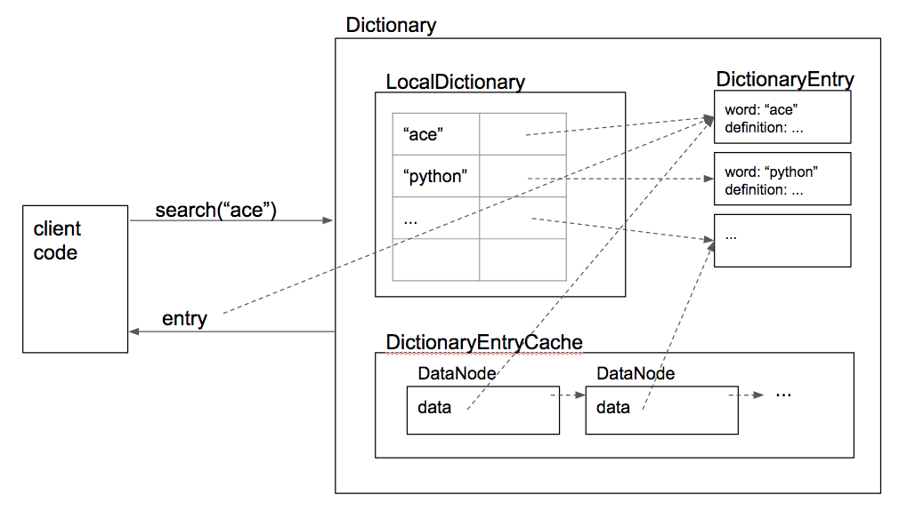

# Local Dictionary
In this project, I wrote a dictionary (in the tradtional sense of the word, not the Python data structure), and 
provided a way for the end-user to enter a word and see its meaning.  This dictionary is a very simplified version of a 
real dictionary, in that each word has only a single part of speech (e.g. noun), a single definition, and optionally, a single example of usage.

## Diagram of Local Dictionary Implementation

